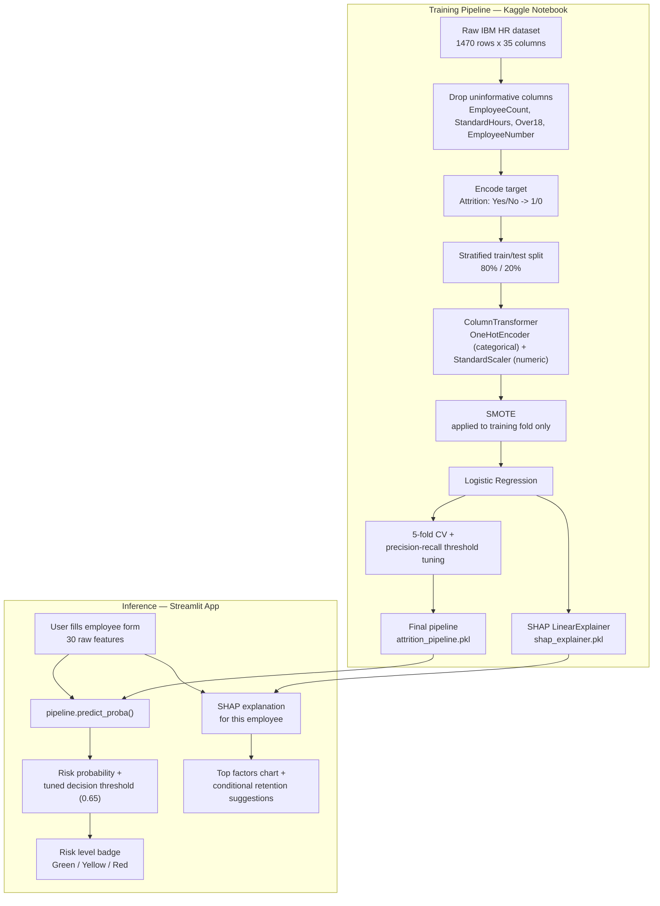

# 💼 Employee Attrition Risk Predictor

## Overview

An end-to-end machine learning system that predicts an employee's risk of attrition (leaving the company) and explains **why**, using SHAP. Built on the IBM HR Analytics dataset and deployed as an interactive Streamlit app.

Rather than a plain Stay/Leave classifier, this project focuses on three things that matter for a real HR tool: a **risk probability** (not just a label), a **decision threshold tuned to the actual business cost** of missing a flight risk, and a **per-employee explanation** of which factors are driving that specific prediction.

🌐 **Live demo:** _update this link after redeploying_

## Business Problem

Replacing an employee costs significant time and money in recruiting, onboarding, and lost productivity. A model that flags at-risk employees early — with a clear, explainable reason — lets HR intervene before a resignation, not after.

## Architecture



The key design point: **all preprocessing (encoding, scaling) lives inside the saved pipeline**, not in the app. The app never touches raw categorical strings or manual column alignment — it hands the pipeline a raw employee record and gets back a probability, same as at training time.

## Dataset

**IBM HR Analytics Employee Attrition & Performance** (Kaggle), 1,470 employee records, 35 original features, zero missing values. Target variable `Attrition` (Yes/No), heavily imbalanced: **1,233 stayed vs. 237 left (~84% / 16%)**.

Four columns were dropped before modeling — confirmed via `nunique()` to carry zero predictive value:

- `EmployeeCount`, `StandardHours`, `Over18` — constant across all 1,470 rows
- `EmployeeNumber` — a row identifier (1,470 unique values), not a feature

## Exploratory Findings

- **OverTime is the strongest single driver**: ~30% of employees working overtime leave, vs. ~10% of those who don't.
- **Income**: median monthly income for those who leave (~3,200) is well below those who stay (~5,200).
- **Job satisfaction** matters proportionally, not in raw counts: at satisfaction level 1, ~23% leave; at level 4, ~11% leave.
- **Numeric correlations with attrition** (full ranking, not just the top few): the strongest are all _negative_ — `TotalWorkingYears` (-0.171), `JobLevel` (-0.169), `YearsInCurrentRole` (-0.161), `MonthlyIncome` (-0.160), `Age` (-0.159). Younger, less senior, less tenured, lower-income employees are the core attrition risk, amplified sharply by overtime.

## Tech Stack

- **Language:** Python
- **Data manipulation:** Pandas, NumPy
- **Machine learning:** Scikit-learn (`Pipeline`, `ColumnTransformer`, `OneHotEncoder`, `StandardScaler`, `LogisticRegression`)
- **Imbalanced data:** imbalanced-learn (SMOTE, applied only to training folds — never at evaluation or inference time)
- **Explainability:** SHAP (`LinearExplainer`)
- **Web framework:** Streamlit

## ML Pipeline

1. **Cleaning:** dropped the 4 uninformative columns, encoded target as binary.
2. **Split:** 80/20 train/test, **stratified** to preserve the 84/16 ratio in both sets (verified: 16.2% train vs. 16.0% test).
3. **Preprocessing:** `ColumnTransformer` — `OneHotEncoder(handle_unknown='ignore', drop='first')` for the 7 categorical features, `StandardScaler` for the 23 numeric features. Scaling was necessary for Logistic Regression to converge and for its coefficients to be comparable to each other.
4. **Class imbalance:** SMOTE wrapped inside an `imblearn.Pipeline`, so oversampling happens only during `.fit()` on training data and is automatically skipped at prediction time — never leaks into evaluation or live app predictions.
5. **Model comparison:** Random Forest, Logistic Regression, and Decision Tree were compared via 5-fold stratified cross-validation before picking a final model (see below) — the choice wasn't the default, it was measured.
6. **Threshold tuning:** the default 0.5 decision threshold was replaced with a threshold chosen from the precision-recall curve on the test set, maximizing F1 for the minority "Leave" class.
7. **Explainability:** SHAP `LinearExplainer` for both global (coefficient-based) and per-prediction explanations.
8. **Deployment:** the entire pipeline (preprocessing + SMOTE + model) is saved as a single object and loaded directly by the Streamlit app.

## Model Comparison

Three models were compared with 5-fold cross-validation before selecting a final one:

| Model                   | F1 (Leave class)  | Recall (Leave class) | ROC-AUC       |
| ----------------------- | ----------------- | -------------------- | ------------- |
| **Logistic Regression** | **0.448 ± 0.036** | **0.679 ± 0.039**    | 0.775 ± 0.017 |
| Random Forest           | 0.383 ± 0.140     | 0.263 ± 0.114        | 0.816 ± 0.024 |
| Decision Tree           | 0.339 ± 0.046     | 0.368 ± 0.076        | 0.609 ± 0.028 |

**Logistic Regression was chosen as the final model**, despite Random Forest's higher ROC-AUC, because:

- Its recall on the "Leave" class is far higher (0.679 vs 0.263) — and recall is the metric that matters most here, since a missed flight risk (false negative) is costlier to the business than an unnecessary check-in (false positive).
- Its cross-validation scores are far more stable (F1 std of ±0.036 vs Random Forest's ±0.140) — with only 237 positive examples in the dataset, that stability is a real advantage, not a minor detail.
- It needs far less threshold tuning to reach good recall, and its coefficients are directly interpretable.

## Final Model Performance (Logistic Regression)

**Default 0.5 threshold** (after adding `StandardScaler`, which also fixed a convergence warning the unscaled version produced):

| Class     | Precision | Recall | F1   |
| --------- | --------- | ------ | ---- |
| Stay (0)  | 0.92      | 0.79   | 0.85 |
| Leave (1) | 0.38      | 0.66   | 0.48 |

ROC-AUC: **0.796**

**Tuned decision threshold: 0.65** (maximizes F1 on the precision-recall curve):

| Class     | Precision | Recall | F1   |
| --------- | --------- | ------ | ---- |
| Stay (0)  | 0.91      | 0.88   | 0.90 |
| Leave (1) | 0.46      | 0.53   | 0.50 |

Overall accuracy at this threshold: 0.83.

**Important caveat:** training data is SMOTE-balanced (~50/50), so raw predicted probabilities are not calibrated to the true ~16% real-world attrition rate — a "high risk" score should be read as a relative ranking between employees, not a literal frequency. This is also why the model's baseline expected value in SHAP explanations sits near 50%, not 16%.

## What Drives Attrition (Model Coefficients)

Logistic Regression coefficients — sign shows direction, magnitude shows strength (valid to compare because numeric features are scaled):

| Feature                            | Coefficient | Direction                        |
| ---------------------------------- | ----------- | -------------------------------- |
| BusinessTravel = Travel Frequently | +1.89       | ↑ risk                           |
| JobRole = Research Director        | -1.85       | ↓ risk                           |
| OverTime = Yes                     | +1.84       | ↑ risk                           |
| JobRole = Laboratory Technician    | +1.63       | ↑ risk                           |
| EducationField = Other             | -1.43       | ↓ risk                           |
| JobRole = Sales Representative     | +1.26       | ↑ risk                           |
| BusinessTravel = Travel Rarely     | +1.12       | ↑ risk                           |
| MaritalStatus = Single             | +0.93       | ↑ risk                           |
| TotalWorkingYears                  | -0.92       | ↓ risk (more experience = safer) |

One nuance worth stating rather than glossing over: both `Travel_Frequently` and `Travel_Rarely` carry positive coefficients relative to the dropped `Non-Travel` baseline — meaning any travel increases risk relative to none, not just frequent travel.

**A genuine, useful finding from this project:** feature rankings shifted between models. Random Forest ranked `OverTime` and `MaritalStatus_Single` highest; Logistic Regression ranks `BusinessTravel` and specific `JobRole` categories more prominently. Both models agree that overtime and low tenure matter a lot — they disagree on the relative weight of secondary factors. That's expected (feature importance is a property of the model, not an absolute truth) and worth being able to explain, not something to hide by only reporting one model's numbers.

## Explainability (SHAP)

Beyond global coefficients, the app generates a **per-employee SHAP explanation** for every prediction, using `LinearExplainer`, showing exactly which factors pushed that individual's risk score up or down — not just which features matter on average.

**Validation example:** the highest-risk employee in the test set was scored at **99.4%** — and had actually left the company. Top contributing factors for that prediction: frequent business travel, overtime, sales representative role, and low total working years — consistent with the global coefficient ranking.

## App Features

- Full input form covering all 30 model features, organized into 4 sections (Employee Info, Compensation & Work Arrangement, Tenure & History, Satisfaction)
- Attrition risk probability with a 🟢🟡🔴 risk level badge, using the tuned 0.65 threshold (with the high-risk cutoff defined relative to the threshold, not a hardcoded number)
- Live SHAP bar chart of the top factors behind each individual prediction
- Retention suggestions generated dynamically from that employee's actual top risk drivers — not a static generic list

## How to Run Locally

1. Clone this repository:
   ```bash
   git clone https://github.com/IsratMou/HR_Attrition_App.git
   ```
2. Install dependencies:
   ```bash
   pip install -r requirements.txt
   ```
3. Run the app:
   ```bash
   streamlit run app.py
   ```
4. Open `http://localhost:8501`.

## Known Limitations

- Small positive class (237 of 1,470 records) limits how stable cross-validation scores are across folds — this is a property of the dataset, not something further tuning fixes.
- SMOTE-balanced training means predicted probabilities are not calibrated to the real-world ~16% base rate; treat scores as relative ranking, not literal likelihood.
- Trained on a single company's historical snapshot — feature relationships (income thresholds, role-specific patterns) may not generalize to other organizations without retraining.
- Feature importance rankings differ between models (Random Forest vs. Logistic Regression); the broad story (overtime + low tenure = highest risk) is consistent, but secondary-factor rankings should be reported with the specific model, not treated as universal truth.

## Future Work

- Hyperparameter tuning (`GridSearchCV` / `Optuna`) for the final Logistic Regression model
- Package as a FastAPI backend in addition to the Streamlit frontend
- Dockerize for reproducible deployment
- Add automated tests for the preprocessing and prediction logic
